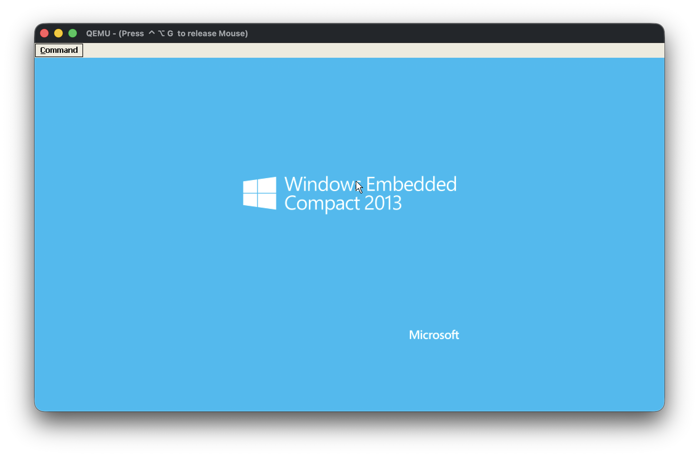
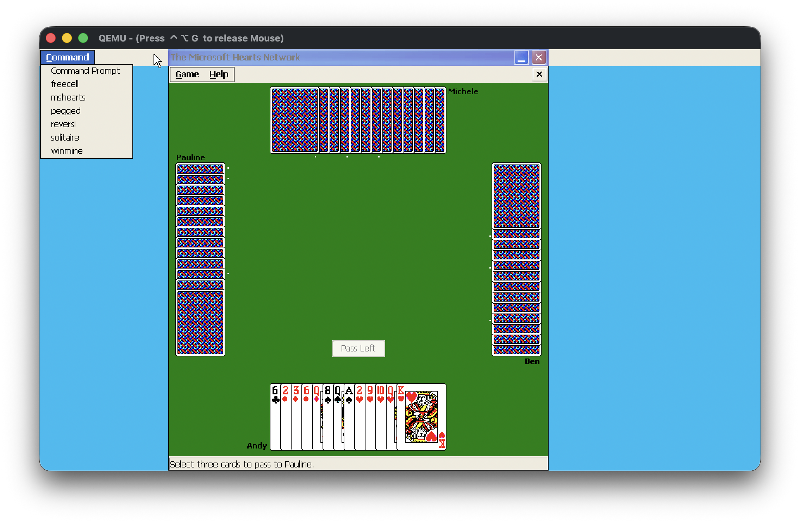

# WinCE 8 (Windows Embedded Compact 2013) BSP for QEMU vexpress-a15

expected configuration:

- 1GB RAM
- PL011 for kernel debug output (UART0) and KITL (UART2)
- PL111 display (1024x600)
- PL050 keyboard/mouse
- PL011 for COM1 port (UART1)
- PL041 audio output
- virtio-tablet-device (on 0x91130600)
- virtio-blk-device (on 0x91130400)
- SMSC LAN9118

example usage (image available on github releases):

qemu-system-arm \
-M vexpress-a15 -m 1G -bios RTSM_VE_CORTEX-A9_MPCORE_EFI.fd \
-drive file=wce8.img,format=raw,if=sd,id=d0 \
-serial stdio -netdev user,id=l0 -net nic,model=lan9118,netdev=l0

Screenshots:

